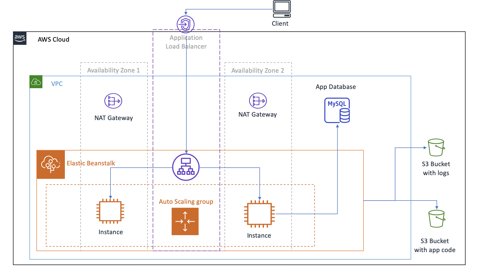

# flask-api-example

This is an example flask api application

## Deployment




### Local
Prerequisites:
- docker
- docker-compose

To run locally with docker:

```
docker-compose up --build
```

### AWS Cloud
Prerequisites:
- aws cli
- terraform cli

To run in AWS cloud with terraform:
```
./deploy_to_eb.sh <region> <namespace> <environment> <app> <keypair>
```

Example:
```
./deploy_to_eb.sh us-west-2 example-ns demo-env flask-api ssh_key
```


